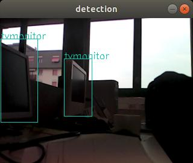

# yolo_ros_detect
ROS package for reading an image stream, detecting objects using YOLO, and visualize detection results

This code is part of the material of the course [Computer Vision and Machine Perception](http://web.unibas.it/bloisi/corsi/visione-e-percezione.html) - University of Basilicata (Italy)

**This code is provided without any warranty about its usability. It is for educational purposes and should be regarded as such.**

## Detection
To run the detection node download
- yolov2.cfg from https://github.com/pjreddie/darknet/blob/master/cfg/yolov2.cfg
- yolov2.weights from https://pjreddie.com/media/files/yolov2.weights
and copy them in the folder "model"

Then type
```
rosrun yolo_ros_detect yolo_detect.py
```

## Visualization
To run the visualization node type
```
rosrun yolo_ros_detect visualizer.py
```

## Results
Detection results on a frame from [this bag](http://profs.scienze.univr.it/~bloisi/corsi/lezionicf/office-r200.bag) are shown below\



